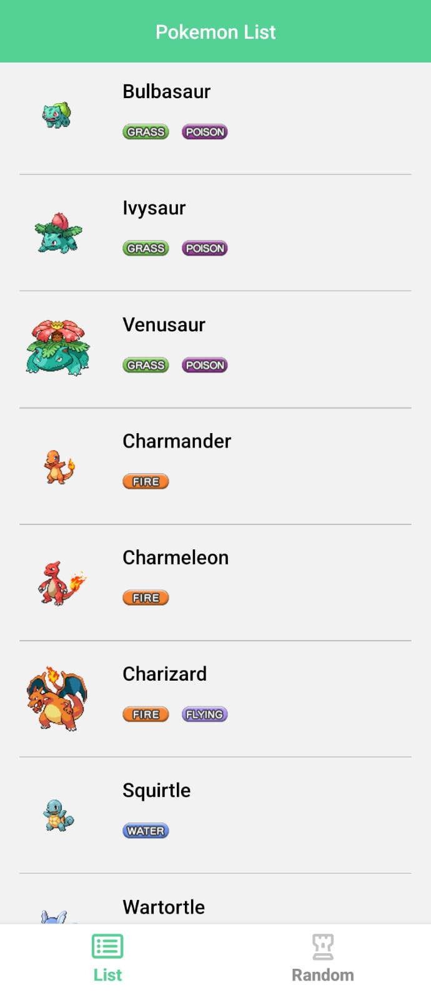
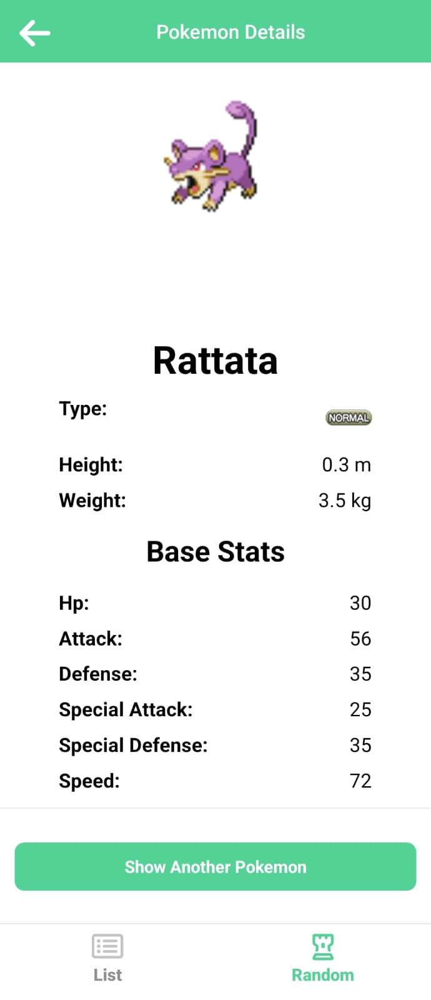
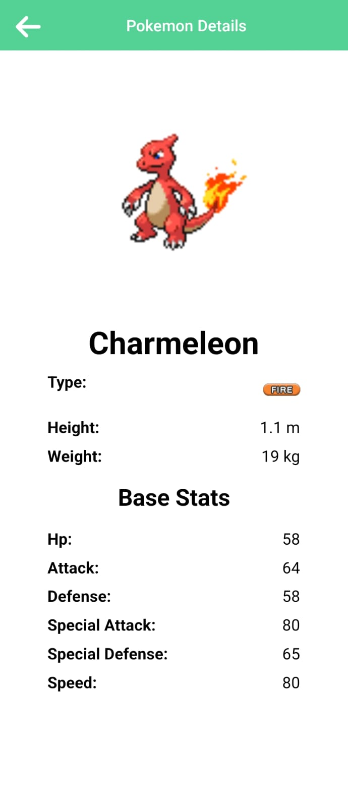

# Pokee

A React Native app that lists Pokemon.

This file explains how to get the project running locally (Android and iOS), manage assets, run tests, and common troubleshooting steps.


## Prerequisites

- Node.js >= 20 (project `engines.node` requires Node 20+)
- Yarn or npm
- React Native development environment:
  - Android: Android Studio + SDK, an emulator or device
  - iOS: Xcode, CocoaPods (macOS only)

Follow the official React Native setup guide for your platform:
https://reactnative.dev/docs/environment-setup

## Quick setup

1. Clone the repo and cd into it:

```bash
git clone <https://github.com/bhagwasiyaritu/Pokee.git>
cd Pokee
```

2. Install dependencies (choose one):

```bash
# using yarn
yarn install

# or using npm
npm install
```

3. Install iOS CocoaPods (macOS only, after npm/yarn install):

```bash
# from repo root
yarn pod or cd ios && pod install && cd .. 
# OR use the provided npm script
npm run pod
```

## Available scripts

These scripts are defined in `package.json`:

- `yarn run android` — build and run on an Android device/emulator
- `yarn run ios` — build and run on iOS Simulator (macOS)
- `yarn start` — start the Metro bundler
- `yarn test` — run Jest tests
- `yarn run lint` — run ESLint
- `yarn run pod` — run `pod install` in `ios`
- `yarn run clean-android` — cleans Android gradle build (runs `./gradlew clean`)

Example: start Metro and run on Android

```bash
# terminal 1: start Metro
yarn start

# terminal 2: run on Android
yarn run android
```

If you prefer npm, replace `yarn` with `npm` (for example: `npm android`).

## Running on device/emulator

Android
- Start an Android emulator from Android Studio or connect a device.
- Run `yarn android`.

iOS (macOS only)
- Ensure CocoaPods dependencies are installed (`yarn pod`).
- Open `ios/Pokee.xcworkspace` in Xcode if you need native debugging.
- Run `yarn ios` to launch the simulator.

## Assets (images, fonts, icons)

- Images used by components are loaded from remote URLs (PokeAPI sprites). There is no special asset bundling required for these remote images.
- Used @react-native-vector-icons/fontawesome6 for icons.

## Testing

This project uses Jest for unit tests and `@testing-library/react-native` for component tests.

Run tests:

```bash
npm test
```

## Common troubleshooting

1. Android build failures

- Run `yarn clean-android`, then rebuild.
- Make sure ANDROID_HOME is configured and SDK platforms are installed.

2. iOS build failures

- Run `yarn pod` to refresh CocoaPods.
- Open `ios/Pokee.xcworkspace` in Xcode and inspect logs.

## I might add

1. ⁠UI could be more polished and Animations can be added.
2. Offline support.
3. Increase test coverage.

## Screenshots IOS

<p align="center">
  
  
  
  
</p>

## Screenshots Android

<p align="center">
  
  
  
</p>